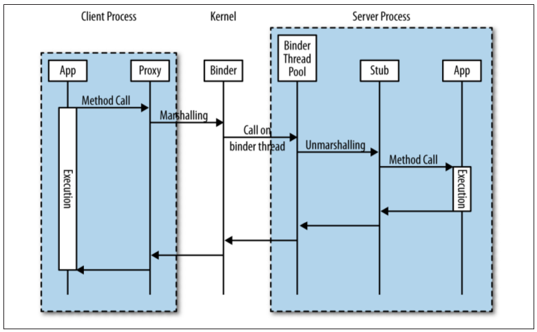
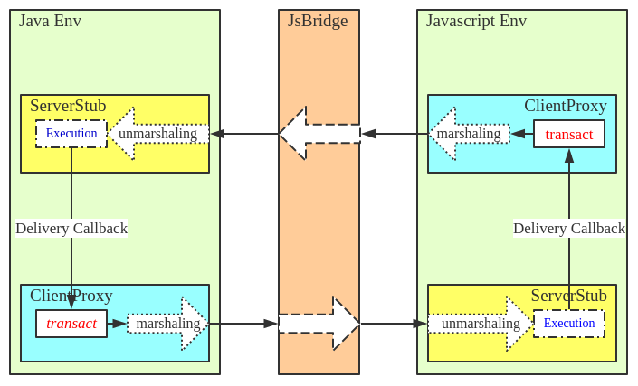
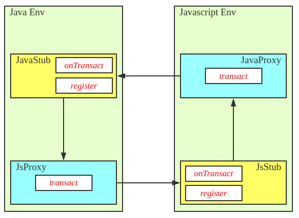

# JsBridge

## 简介

Android JsBridge 就是用来在 Android app的原生 java 代码与 javascript 代码中架设通信（调用）桥梁的辅助工具。 

[使用方式戳这里](#anchor_usage)

整个工程还在完善过程中，有问题请联系 [xesam](http://xesam.github.io/about/)

## 原理概述

Javascript 运行在 WebView 中，而 WebView 只是 Javascript 执行引擎与页面渲染引擎的一个包装而已。

由于这种天然的隔离效应，我们可以将这种情况与 IPC 进行类比，将 Java 与 Javascript 的每次互调都看做一次 IPC 调用。
如此一来，我们可以模仿各种已有的 IPC 方式来进行设计，比如 RPC。本文模仿 Android 的 Binder 机制来实现一个 JsBridge。

首先回顾一一下基于 Binder 的经典 RPC 调用：



当然，client 与 server 只是用来区分通信双方责任的叫法而已，并不是一成不变的。
对于 java 与 javascript 互调的情况，当 java 主动调用 javascript 的时候，java 充当 client 角色，javascript 则扮演 server 的角色，
javascript 中的函数执行完毕后回调 java 方法，这个时候，javascript 充当 client 角色，而 javascript 则承担 server 的责任。



剩下的问题就是怎么来实现这个机制了，大致有这么几个需要解决的问题：

1. java 如何调用 Javascript
2. Javascript 如何调用 java
3. 方法参数以及回调如何处理
4. 通信的数据格式是怎样的

下面逐个讨论这些问题：

##  1. java 如何调用 Javascript

要实现 Java 与 Javascript 的相互调用，有两条途径可以考虑：

1. 集成一个定制化的 Javascript 与 Html 渲染引擎，java 通过引擎底层与 Javascript 交互。这样可以获得完全的控制权。
2. 使用 Android Sdk 提供的交互方法。

对于第一种途径，代价比较大，而且技术方案比较复杂，一般只有基于 Javascript 的跨平台开发方案才会这么做。
所以，现在着重考查第二种途径。

Android 的默认 Sdk 中， Java 与 Javascript 的一切交互都是依托于 WebView 的，大致有以下几个可用方法：

##### 第一， Java 调用 Javascript 方法

```java
    webView.loadUrl("javascript:scriptString"); //其中 scriptString 为 Javascript 代码
```
在 KITKAT 之后，又新增了一个方法：

```java
    webView.evaluateJavascript(scriptString, new ValueCallback<String>() {
        @Override
        public void onReceiveValue(String value) {
    
        }
    });//其中 scriptString 为 Javascript 代码，ValueCallback 的用来获取 Javascript 的执行结果。这是一个异步掉用。
```

这个调用看起比上面的正常，而且更像是一个方法调用。

需要注意的是，ValueCallback 并不是在 UI 线程里面执行的。

##  2. Javascript 如何调用 java

要实现 Javascript 调用 java 方法，需要先在 Javascript 环境中注入一个 Java 代理：

```java

    class JavaProxy{
        @JavascriptInterface //注意这里的注解。出于安全的考虑，4.2 之后强制要求，不然无法从 Javascript 中发起调用
        public void javaFn(){
            //xxxxxx
        };
    }

    webView.addJavascriptInterface(new JavaProxy();, "java_proxy");
```

然后在 Javascript 环境中直接调用 obj_proxy 代理上的方法即可。

```javascript

    java_proxy.javaFn();
```

这里有两个方面需要统一：

1. Javascript 的执行方法比较怪异，所以，我们需要将概念统一化。
2. 如果需要执行的方法比较多，那么，代理对象上也需要定义非常多的方法，我们需要将各种方法定义统一起来管理。

所以，我们先将 Javascript 的执行包装成类似 java 一样的代理对象，然后通过在各自的 stub 上注册回调来增加功能支持。
比如，如果 java 想增加 getPackageName 方法，那么，直接在 JavaProxy 上注册即可：

```java

    javaProxy.register("getPackageName", new JavaHandler(){
        @Override
        public void handle(Object value){
            //xxxxx
        }
    })
```

如图：



## 3. 方法参数以及回调如何处理

很显然，任何 IPC 通信都涉及到参数序列化的问题， 同理 java 与 Javascript 之间只能传递基础类型（注意，不单纯是基本类型），包括基本类型与字符串，不包括其他对象或者函数。
由于只涉及到简单的相互调用，这里就可以考虑采用 JSON 格式来传递各种数据，轻量而简洁。

Java 调用 Javascript 没有返回值（这里指 loadUrl 形式的调用），因此如果 java 端想从 Javascript 中获取返回值，只能使用回调的形式。
但是在执行完毕之后如何找到正确的回调方法信息，这是一个重要的问题。比如有下面的例子：

在 java 环境中，JavaProxy 对象有一个无参数的 getPackageName 方法用来获取当前应用的 PackageName。
获取到 packageName 之后，传递给 Javascript 调用者的对应回调中。

在 Javascript 环境中，获取当前应用的 PackageName 的大致调用如下：

```javascript
    bridge.invoke('getPackageName', null, function(packageName){
        console.log(packageName);
    });

````

显然

```javascript
    function(packageName){
        console.log(packageName);
    }
       
```

这个 Javascript 函数是无法传递到 java 环境中的，所以，可以采取的一个策略就是，
在 Javascript 环境中将所有回调统一管理起来，而只是将回调的 id 传递到 java 环境去，java 方法执行完毕之后，
将回调参数以及对应的回调 id 返回给 Javascript 环境，由 Javascript 来负责执行正确的回调。

这样，我们就可以实现一个简单的回调机制：

在 java 环境中

```java

    class JavaProxy{
        public void onTransact(String jsonInvoke, String jsonParam){
            json = new Json(jsonInvoke);
            invokeName = json.getInvokeName(); // getPackageName
            callbackId = json.getCallbackId(); // 12345678xx
            invokeParam = new Param(jsonParam);// null
            
            ...
            ...
            
            JsProxy.invoke(callbackId, callbackParam); //发起 Javascript 调用，让 Javascript 去执行对应的回调
        }
    }

```

在 javascript 环境中

```javascript
    
    bridge.invoke = function(name, param, callback){
        var callbackId = new Date().getTime();
        _callbacks[callbackId] = callback;
        var invoke = {
            "invokeName" : name,
            "callbackId" : callbackId
        };
        JavaProxy.onTransact(JSON.stringify(invoke), JSON.stringify(param));
    }
    
     bridge.invoke('getPackageName', null, function(packageName){
         console.log(packageName);
     });  
```

反之亦然。

## 4. 通信的数据格式是怎样的

问题都处理了，只需要设计对应的协议即可。
按照上面的讨论,

在 client 端：

我们使用 

```java
    Proxy.transact(invoke, callback);
```

来调用 server 端注册的方法。


在 server 端

我们使用 

```java
    Stub.register(name, handler);
```

来注册新功能，使用 

```java
    Stub.onTransact(invoke, handler);
```

来处理接收到的 client 端调用。

其中，invoke 包含所要执行的方法以及回调的信息，因此，invoke 的设计如下：

```javascript
{
    _invoke_id : 1234,  
    _invoke_name : "xxx",  
    _callback_id : 5678,  
    _callback_name : "xxx"  
}
```

注意 _invoke_id 与 _invoke_name 的区别：

    如果当前 invoke 是一个直接方法调用，那么 _invoke_id 应该是无效的。
    如果当前 invoke 是一个回调，那么 _invoke_id + _invoke_name 共同决定回调的具体对象

## 需要注意的问题

1. 回调函数需要及时删除，不然会引起内存泄漏。

## 使用
<a name="anchor_usage"></a>

### 必要配置

请在对应的 html 页面中引入

```html
    <script src="js-bridge.js"></script>
```

### Java 环境

初始化 JsBridge:

```java
    jsBridge = new JsBridge(vWebView);
```

Java 注册处理方法：

```java
    jsBridge.register(new SimpleServerHandler("showPackageName") {
        @Override
        public void handle(String param, ServerCallback serverCallback) {
            new Handler(Looper.getMainLooper()).post(new Runnable() {
                @Override
                public void run() {
                    String packageName = getPackageName();
                    Tip.showTip(getApplicationContext(), "showPackageName:" + packageName);
                }
            });
        }
    });
```

Java 在处理方法中回调 Javascript：

```java

    @Override
    public void handle(final String param, final ServerCallback serverCallback) {
        new Handler(Looper.getMainLooper()).post(new Runnable() {
            @Override
            public void run() {
                User user = getUser();
                Map<String, String> map = new Gson().fromJson(param, Map.class);
                String prefix = map.get("name_prefix");
                Tip.showTip(mContext, "user.getName():" + prefix + "/" + user.getName());
                if ("standard_error".equals(prefix)) {
                    Map<String, String> map1 = new HashMap<>();
                    map1.put("msg", "get user failed");
                    String userMarshalling = new Gson().toJson(map1);
                    serverCallback.invoke("fail", new MarshallableObject(userMarshalling));
                } else {
                    String userMarshalling = new Gson().toJson(user);
                    serverCallback.invoke("success", new MarshallableObject(userMarshalling));
                }
            }
        });
    }
```

Java 执行 Js 函数：

```java

    jsBridge.invoke("jsFn4", new MarshallableString("yellow"), new ClientCallback<String>() {
        @Override
        public void onReceiveResult(String invokeName, final String invokeParam) {
            if ("success".equals(invokeName)) {

                new Handler(Looper.getMainLooper()).post(new Runnable() {
                    @Override
                    public void run() {
                        Tip.showTip(getApplicationContext(), invokeParam);
                    }
                });
            }
        }

        @Override
        public String getResult(String param) {
            return param;
        }
    });
```

### Javascript 环境
Javascript 的灵活性比较高，所以要简单一些：

Javascript 注册处理函数：

```javascript
    window.JavaBridge.serverRegister('jsFn4', function (transactInfo, color) {
        log("jsFn4:" + color);
        title.style.background = color;
        log("jsFn4:callback");
        transactInfo.triggerCallback('success', 'background change to ' + color);
    });
```

Javascript 执行 Java 方法：

```javascript

    var sdk = {
        getUser: function (params) {
            var _invokeName = 'getUser';
            var _invokeParam = params;
            var _clientCallback = params;
            window.JavaBridge.invoke(_invokeName, _invokeParam, _clientCallback);
        }
    };

    sdk.getUser({
        "name_prefix": "standard_error",
        "success": function (user) {
            log('sdk.getUser,success:' + user.name);
        },
        "fail": function (error) {
            log('sdk.getUser,fail:' + error.msg);
        }
    })
```

详细 Demo 请参见 [js-bridge-demo](https://github.com/xesam/JsBridge) 工程


